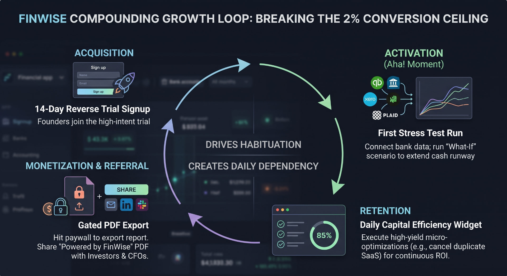

# The Bet · FinWise

> Module 1 · Ignite a PLG Motion. The growth hypothesis and where you're betting, plus the growth-loop visualization.

## Growth hypothesis

If we transform the FinWise dashboard from a passive reporting tool into an active "Capital Efficiency" engine (X), then we will break the 2% conversion ceiling and reduce the 60% churn rate (Y), because users will experience immediate, tangible financial ROI that builds a daily operational habit before they are ever asked to pay (Z).

## The bet

We are making an activation and behavioral design bet. We are focusing entirely on habituation—forcing daily engagement by surfacing actionable financial micro-optimizations (like canceling duplicate SaaS subscriptions). We are deliberately NOT pouring more marketing budget into top-of-funnel paid acquisition, nor are we just lowering the price, because throwing more users into a leaky, low-engagement bucket will not fix the structural churn issue.

## Growth loop

