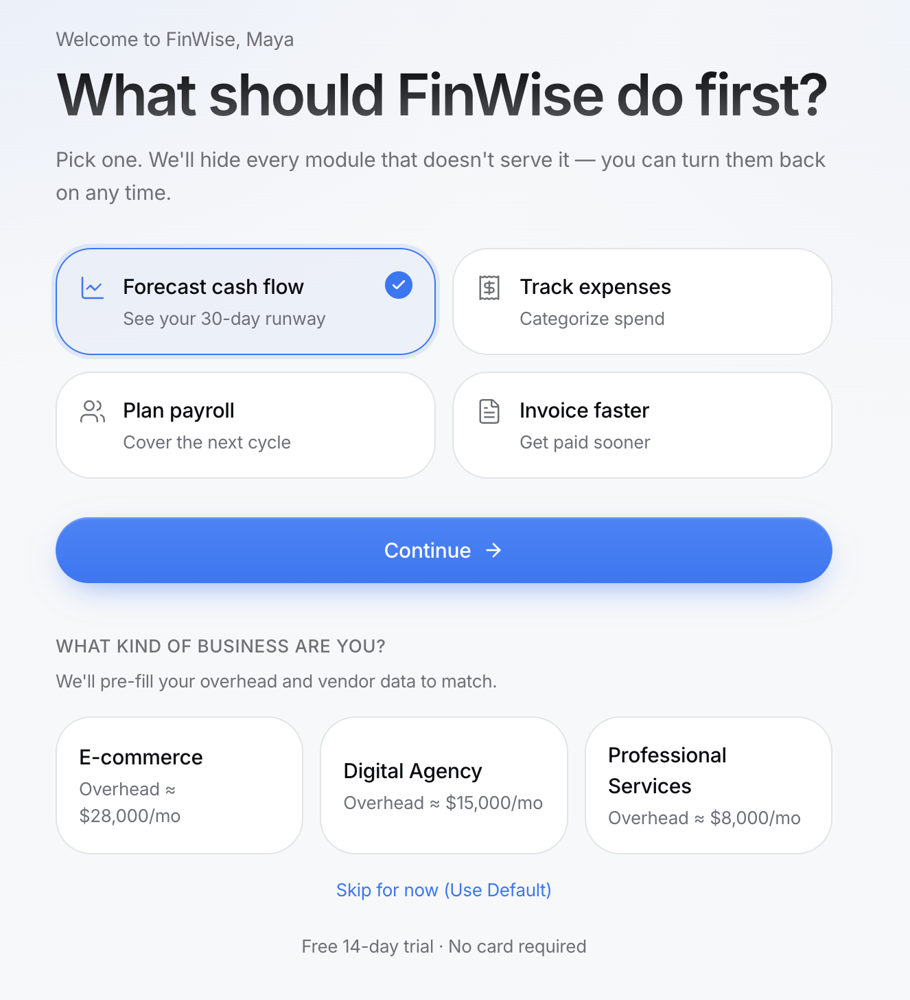
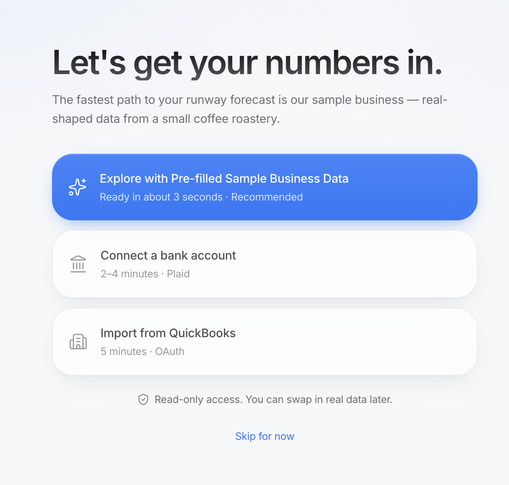
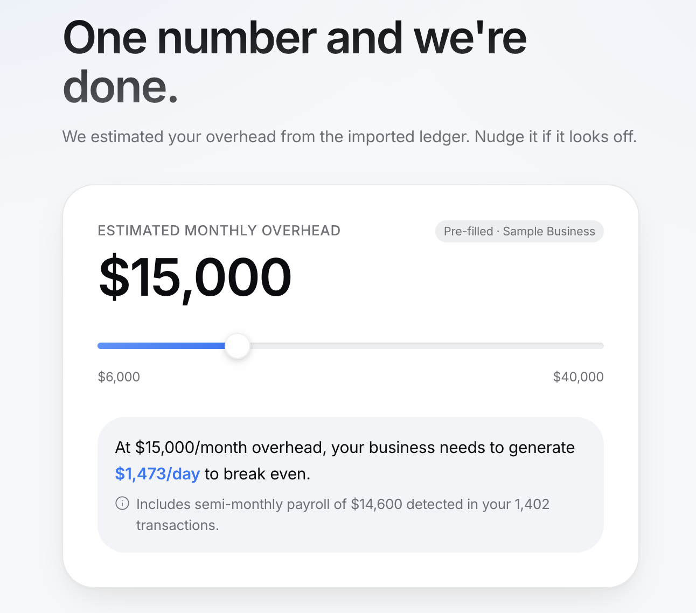
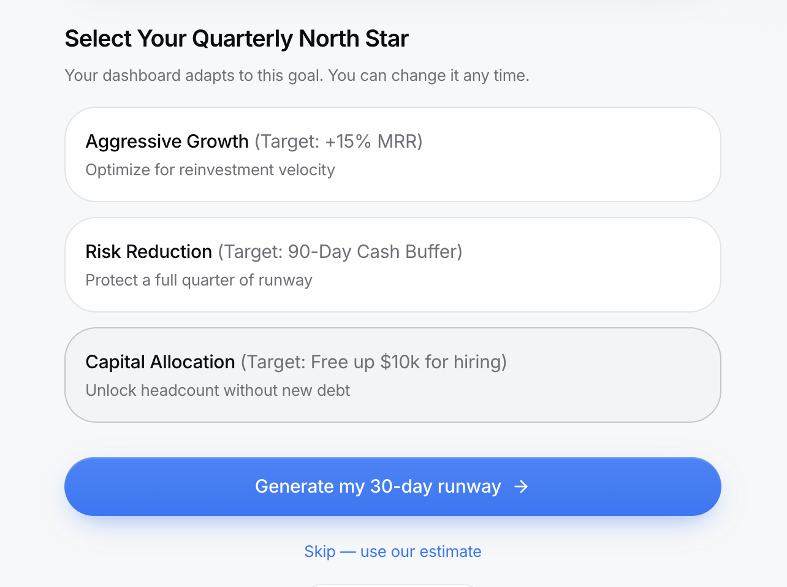

# The Solution · FinWise

> Module 2 · Acquisition & Activation. The onboarding solution and the Aha moment that makes value land.

## Aha moment

The exact moment a founder connects their bank data, runs their first industry-specific "What-If" stress test, and visually sees how a single strategic operational change (like lowering target COGS by 4%) instantly extends their cash runway.

_____

## Onboarding prototype

Our prototype replaces the standard, frictionless checklist with a high-trust, "Vibe-Coded" flow. It utilizes a "North Star Goal" selector (e.g., Risk Reduction vs. Aggressive Growth) and a "Forecast Calibration" diagnostic to instantly personalize the workspace before the user even reaches the main dashboard.

**Live prototype:** https://runway-reveal-prototype.lovable.app

### Screen 1 · Intent & Industry

### Screen 2 · Frictionless Data Connection

### Screen 3 · Forecast Calibration

### Screen 4 · Quarterly North Star Goal

_____

## Why this activates

It eliminates the "blank slate" problem. By capturing the user's industry and primary goal during onboarding, the dashboard immediately acts like a Fractional CFO rather than a passive reporting tool. The inputs are no longer generic—they are hyper-personalized to the user's specific business model, accelerating time-to-value and proving immediate financial ROI on day one.

_____
