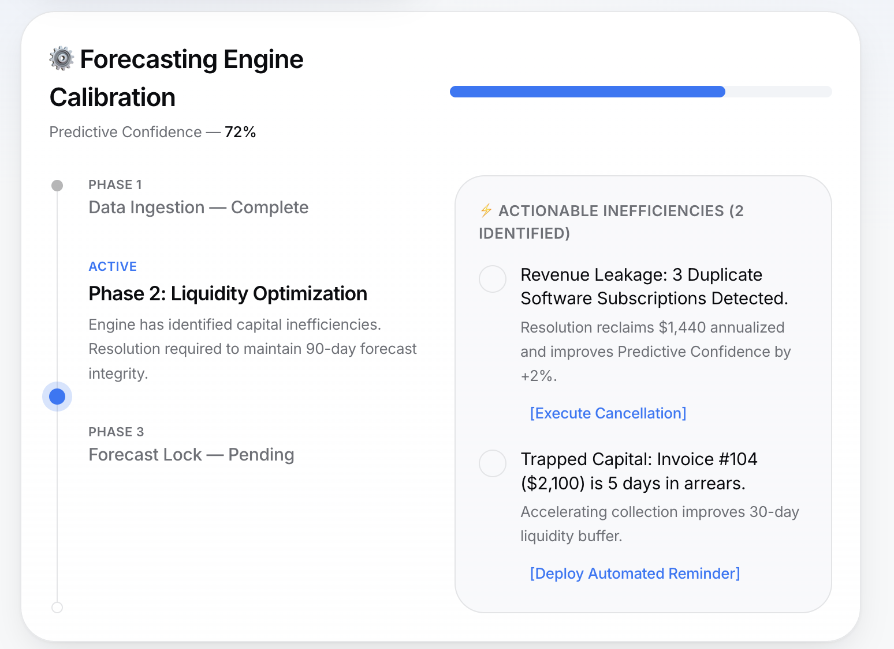

# The Mechanic · FinWise

> Module 3 · Retention & Engagement. The engagement mechanic that builds the habit loop, with rationale and a wireframe.

## The mechanic

_The habit loop: trigger → action → reward → investment._

We designed the **"Capital Efficiency" Widget**, which gamifies financial ROI rather than using standard points or badges.

**Trigger:** A daily dashboard alert flagging an "Actionable Inefficiency" or trapped capital (e.g., a duplicate SaaS subscription or overdue invoice).

**Action:** The user logs in to clear the widget by executing the micro-optimization (e.g., clicking to cancel or categorize).

**Reward:** Immediate financial ROI—the UI instantly updates to show exactly how many days were just added to their cash runway.

**Investment:** The user's financial data is cleaned and synced, making the predictive models highly accurate and deepening their operational reliance on the platform.

_____

## Rationale

_Why this drives retention before the paywall._

B2B founders reject traditional, gamey gamification. By re-skinning tedious data hygiene and bookkeeping chores into high-leverage **"Yield Opportunities,"** we gamify business survival. This creates a daily dopamine hit of profit optimization, transforming FinWise from a passive, once-a-month reporting tool into an active, daily dependency. This daily habit combats the 60% churn rate before they are ever asked to pay.

_____

## Wireframe

_The Habit Loop in Action:_

- **The Trigger:** The "Actionable Inefficiencies" alert catches the founder's eye.
- **The Action:** Frictionless, one-click execution via the [Execute Cancellation] and [Deploy Automated Reminder] buttons.
- **The Reward & Investment:** Explicit financial ROI (e.g., "reclaims $1,440 annualized") that directly improves the system's "Predictive Confidence," deepening their reliance on the tool.

_____
